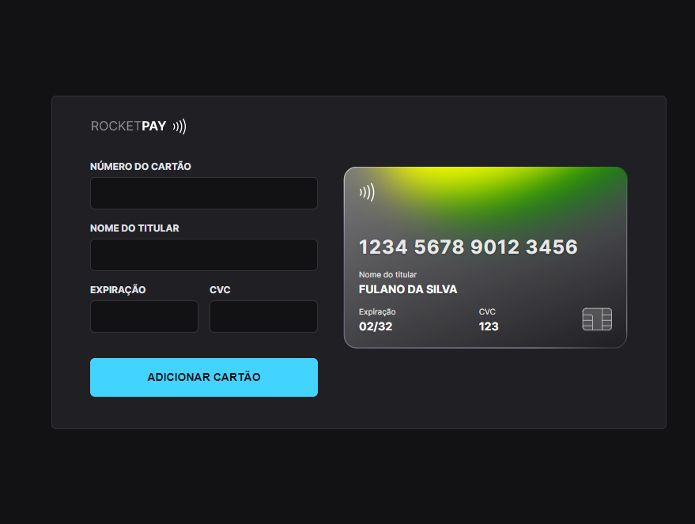

# Explorer Lab #01 

## 💻 Projeto

O Rocketpay é um componente que simula o formulário de preenchimento de cartão de crédito, onde é possível adicionar máscara aos inputs e atualizar elementos HTML via DOM.

## 🚀 Tecnologias

- HTML e CSS
- JavaScript e JSON
- Node e NPM
- Vite
- iMask

## 📧 Contact

- mathtg2@gmail.com
- https://www.linkedin.com/in/matheus-patrickz/

